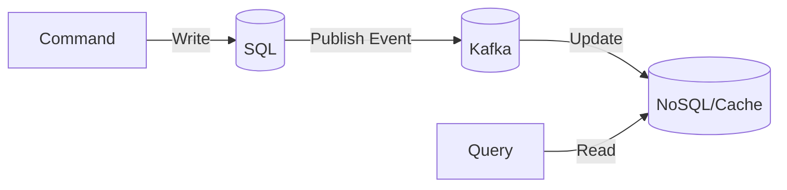
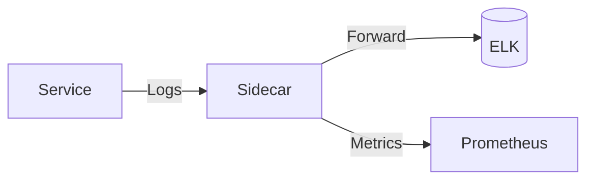

### **Microservices Design Patterns: CQRS & Sidecar**  

These patterns address different challenges in microservices:  
- **CQRS** optimizes data handling by separating reads and writes.  
- **Sidecar** extends service functionality without modifying the main application.  

Let’s break them down with examples, pros/cons, and tools.

---

## **1. CQRS (Command Query Responsibility Segregation)**  
### **What?**  
Split data operations into:  
- **Commands (Writes)**: Modify state (e.g., `CreateOrder`, `UpdateUser`).  
- **Queries (Reads)**: Fetch data (e.g., `GetOrder`, `ListProducts`).  

### **Why?**  
- **Performance**: Optimize read/write paths independently.  
- **Scalability**: Scale reads separately from writes.  
- **Flexibility**: Use different data models (e.g., SQL for writes, NoSQL for reads).  

### **How It Works**  


#### **Example: E-Commerce**  
- **Command Side**:  
  ```java
  @PostMapping("/orders")
  public void createOrder(@RequestBody OrderCommand command) {
    commandService.createOrder(command); // Writes to SQL
  }
  ```
- **Query Side**:  
  ```java
  @GetMapping("/orders/{id}")
  public OrderView getOrder(@PathVariable String id) {
    return queryService.getOrder(id); // Reads from Elasticsearch/Cache
  }
  ```

### **Pros & Cons**  
| Pros                          | Cons                                  |
|-------------------------------|---------------------------------------|
| ✅ Optimized read/write paths  | ❌ Eventual consistency complexity    |
| ✅ Independent scaling         | ❌ Harder to debug (dual models)      |
| ✅ Flexible storage choices    | ❌ Overkill for simple CRUD apps      |

### **Tools**  
- **Event Sourcing**: Kafka, Axon Framework.  
- **Read Models**: Elasticsearch, Redis, MongoDB.  
- **Frameworks**: Spring Cloud, .NET MediatR.  

---

## **2. Sidecar Pattern**  
### **What?**  
Attach a helper container (sidecar) to a primary service to offload cross-cutting concerns:  
- Logging, monitoring, security, or network proxying.  

### **Why?**  
- **Separation of Concerns**: Keeps main service focused on business logic.  
- **Reusability**: Sidecars can be reused across services (e.g., Istio proxy).  

### **How It Works**  


#### **Example: Service Mesh (Istio)**  
- **Primary Service**: `OrderService` (business logic).  
- **Sidecar**: `Envoy Proxy` (handles TLS, retries, load balancing).  

#### **Kubernetes Example**  
```yaml
apiVersion: apps/v1
kind: Deployment
metadata:
  name: order-service
spec:
  containers:
  - name: order-app   # Primary container
    image: order-service:latest
  - name: envoy-sidecar # Sidecar
    image: envoyproxy/envoy
    ports:
    - containerPort: 9080
```

### **Pros & Cons**  
| Pros                          | Cons                                  |
|-------------------------------|---------------------------------------|
| ✅ Decouples infrastructure   | ❌ Adds resource overhead             |
| ✅ Uniform observability      | ❌ Debugging sidecar issues is hard   |
| ✅ No code changes needed     | ❌ Complexity in networking          |

### **Tools**  
- **Service Mesh**: Istio, Linkerd.  
- **Logging**: Fluentd, Filebeat.  
- **Monitoring**: Prometheus, OpenTelemetry.  

---

## **When to Use Which?**  
| Pattern   | Best For                                         | Avoid When                          |
|-----------|--------------------------------------------------|-------------------------------------|
| **CQRS**  | High-read systems (e.g., dashboards, reports)    | Simple CRUD apps                    |
| **Sidecar** | Offloading infra tasks (e.g., logging, TLS)    | Low-latency requirements            |

---

## **Key Takeaways**  
1. **CQRS**:  
   - Split reads/writes for scalability.  
   - Use with **Event Sourcing** for auditability.  
2. **Sidecar**:  
   - Attach reusable helpers (e.g., Istio proxy).  
   - Ideal for **service meshes** and cross-cutting concerns.  

Would you like a deep dive into implementing CQRS with Kafka or Istio sidecars?


-------------------

Great! Let's explore two important **microservices design patterns** — **CQRS** and **Sidecar** — which help solve specific architectural and operational challenges.

---

## ✅ 1. **CQRS (Command Query Responsibility Segregation)**

### 🔹 What is CQRS?

CQRS is a pattern that **separates read and write operations** into **different models and services**.

* **Command = Write operations** (Create, Update, Delete)
* **Query = Read operations** (Get, Search, Filter)

---

### 🔸 Why Use CQRS?

| Benefit                    | Description                                      |
| -------------------------- | ------------------------------------------------ |
| Scalability                | Read and write workloads can scale independently |
| Performance                | Read models optimized for fast queries           |
| Flexibility                | Read model can be denormalized or cached         |
| Simplicity of logic        | Write model follows strict validation and rules  |
| Event sourcing integration | Works well with event-driven systems             |

---

### 🔸 CQRS Architecture Overview

```
[Client]
   |
[API Gateway]
   |
[Command Service]     [Query Service]
     |                      |
[Write DB]             [Read DB / Cache]
```

* Write to `Command Service` → persist → publish event.
* `Query Service` subscribes to events → updates its own read store.

---

### 🔸 When to Use CQRS?

✅ When:

* You have **high read/write ratio** (e.g., 90% reads, 10% writes)
* Domain is **complex and requires different data shapes**
* You want to support **event-driven architecture**

❌ Avoid for:

* Simple CRUD applications (adds complexity)

---

## ✅ 2. **Sidecar Pattern**

### 🔹 What is the Sidecar Pattern?

The **Sidecar pattern** involves deploying a helper component **alongside a microservice** in the same container or pod (in Kubernetes). The sidecar handles **common concerns**, such as:

* Logging
* Proxying / Service mesh (e.g., Envoy)
* Monitoring
* Configuration
* Security (TLS, token refresh)

---

### 🔸 Why Use Sidecar?

| Benefit                        | Description                                          |
| ------------------------------ | ---------------------------------------------------- |
| Language agnostic              | Works regardless of service tech stack               |
| DRY principle                  | Handles cross-cutting concerns uniformly             |
| Easy to update                 | Sidecar can be updated without touching main service |
| Works well with service meshes | Like Istio or Linkerd                                |

---

### 🔸 Sidecar Pattern Architecture

```
+---------------------+       +---------------------+
| Main Service (App)  |       | Main Service (App)  |
|                     |       |                     |
| Container A         |<----->| Container B         |
|                     |       |                     |
| Logging, Monitoring |       | Proxy, Config       |
+---------------------+       +---------------------+
          |                             |
          |                             |
         [Pod]                        [Pod]
```

Example: In Kubernetes, both containers run in the same **Pod**, and the Sidecar is automatically injected (e.g., by Istio).

---

### 🔸 When to Use the Sidecar Pattern?

✅ Use it when:

* You need **observability, service discovery, TLS, retries** handled transparently
* You're adopting a **service mesh** like Istio, Consul Connect, or Linkerd
* You want to isolate **cross-cutting concerns** from business logic

---

## 🧠 Summary Comparison

| Feature          | CQRS                                  | Sidecar                            |
| ---------------- | ------------------------------------- | ---------------------------------- |
| Purpose          | Separate read/write concerns          | Externalize cross-cutting concerns |
| Pattern Type     | Application-level                     | Infrastructure-level               |
| Use Case         | High-scale reads, complex writes      | Logging, service mesh, monitoring  |
| Example Tools    | Axon, EventStore, Kafka, Redis        | Envoy, Istio, Fluentd, Prometheus  |
| Adds Complexity? | Yes (data sync, eventual consistency) | Minimal (transparent to main app)  |

---

Would you like a **code example for CQRS using Spring Boot and Kafka** or a **diagram showing the Sidecar pattern in Kubernetes**?
