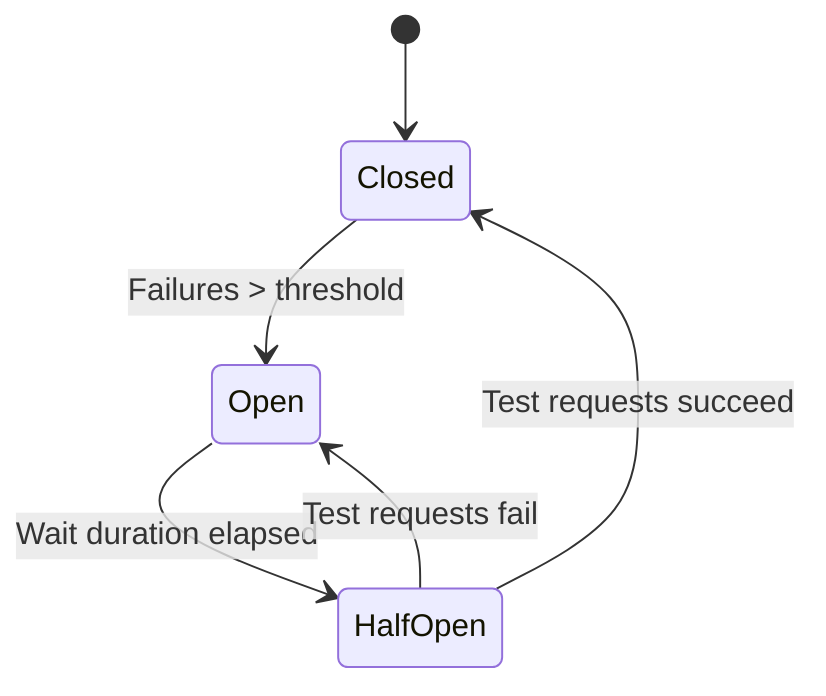

# **Circuit Breaker States: Open, Half-Open, and Closed**  

The **Circuit Breaker Pattern** is a resilience mechanism in microservices that prevents cascading failures by monitoring requests and temporarily blocking calls to failing services. It operates in **three states**:  

| State        | Description                                                                 | Behavior                                                                 |
|--------------|-----------------------------------------------------------------------------|--------------------------------------------------------------------------|
| **Closed**   | Normal operation (requests pass through).                                   | All requests are allowed. Failures increment a counter.                  |
| **Open**     | Circuit is tripped (requests are blocked).                                  | All requests fail fast. After a timeout, transitions to **Half-Open**.  |
| **Half-Open**| Probational state (tests if the service recovered).                         | A limited number of test requests are allowed. If successful → **Closed**; if failed → **Open**. |

---

## **1. Closed State (Normal Operation)**  
- **When**:  
  - The service is healthy.  
  - Failures are below the threshold (e.g., < 50% errors in last 60 seconds).  

- **Behavior**:  
  - Requests are forwarded to the downstream service.  
  - Failures are recorded (e.g., timeouts, 5xx errors).  

- **Example (Resilience4j Config)**:  
  ```yaml
  resilience4j.circuitbreaker:
    instances:
      orderService:
        failure-rate-threshold: 50     # Trip if 50% of calls fail
        sliding-window-size: 10        # Last 10 calls are evaluated
        minimum-number-of-calls: 5     # Minimum calls before tripping
  ```

---

## **2. Open State (Fail Fast)**  
- **When**:  
  - Failures exceed the threshold (e.g., 5 failures in a row).  

- **Behavior**:  
  - **All requests are rejected immediately** (no calls to the failing service).  
  - Returns a fallback response (e.g., cached data, error message).  
  - After a **wait duration**, transitions to **Half-Open**.  

- **Example (Fallback in Spring Boot)**:  
  ```java
  @CircuitBreaker(name = "orderService", fallbackMethod = "fallback")
  public Order getOrder(String id) {
      return orderClient.getOrder(id);  // Calls OrderService
  }

  public Order fallback(String id, Exception ex) {
      return Order.cachedOrder(id);     // Fallback response
  }
  ```

---

## **3. Half-Open State (Probation)**  
- **When**:  
  - The circuit has been **Open** for the configured wait time (e.g., 30 seconds).  

- **Behavior**:  
  - Allows a **limited number of test requests** (e.g., 3 requests).  
  - If all succeed → Circuit transitions to **Closed**.  
  - If any fail → Circuit returns to **Open**.  

- **Example (Resilience4j)**:  
  ```yaml
  resilience4j.circuitbreaker:
    instances:
      orderService:
        wait-duration-in-open-state: 30s   # Time before Half-Open
        permitted-number-of-calls-in-half-open-state: 3  # Test requests
  ```

---

## **Why These States Matter**  
1. **Prevents Overload**:  
   - Stops flooding a failing service with requests (gives it time to recover).  
2. **Graceful Degradation**:  
   - Provides fallbacks instead of crashing.  
3. **Auto-Recovery**:  
   - Automatically retests failed services without manual intervention.  

---

## **Tools Implementing Circuit Breakers**  
| Tool/Framework       | Example Configuration                          |
|----------------------|-----------------------------------------------|
| **Resilience4j**     | `@CircuitBreaker` (Spring Boot).              |
| **Hystrix**          | `@HystrixCommand` (Legacy, deprecated).       |
| **Spring Cloud Circuit Breaker** | Supports Resilience4j, Sentinel. |
| **Envoy Proxy**      | HTTP outlier detection (service mesh).        |

---

## **Real-World Example**  
### **Scenario**:  
- `PaymentService` starts failing due to high load.  

### **Flow**:  
1. **Closed**: Requests fail 6/10 times → Circuit trips to **Open**.  
2. **Open**: All requests return `503 Service Unavailable` for 30 seconds.  
3. **Half-Open**: After 30s, 3 test requests are allowed.  
   - If 2/3 succeed → **Closed**.  
   - If 2/3 fail → **Open** again.  



---

## **Best Practices**  
1. **Tune Thresholds**:  
   - Set `failure-rate-threshold` based on SLA (e.g., 20% for critical services).  
2. **Log State Changes**:  
   - Alert when circuits open (e.g., Slack/PagerDuty).  
3. **Fallback Strategies**:  
   - Cache, default values, or queue requests for later retry.  
4. **Avoid Long Timeouts**:  
   - Prefer `timeout: 2s` over waiting indefinitely.  

---

## **Key Takeaways**  
- **Closed**: Healthy, requests flow.  
- **Open**: Fail fast, no requests.  
- **Half-Open**: Tests recovery.  
- Use **Resilience4j/Spring Cloud** for Java, **Envoy** for service mesh.  

Would you like a deep dive on integrating circuit breakers with Kubernetes?

----

Great question! You're referring to the **Circuit Breaker pattern**, which is widely used in microservices to handle **fault tolerance** and **resilience**.

Let’s break down the **three key states** of a Circuit Breaker:

---

## 🔌 Circuit Breaker Pattern States

| State         | Description                                                                            |
| ------------- | -------------------------------------------------------------------------------------- |
| **Closed**    | Normal operation: All requests go through.                                             |
| **Open**      | The system is failing: Requests are blocked to prevent overload.                       |
| **Half-Open** | Recovery phase: Some requests are allowed through to test if the system has recovered. |

---

### ✅ 1. **Closed State**

* Everything is working fine.
* Requests pass through as normal.
* Circuit breaker monitors failures (timeouts, exceptions, etc.).

#### 🔸 When does it leave this state?

➡ If the **failure threshold** is exceeded (e.g., 50% failures), it transitions to **Open**.

---

### ❌ 2. **Open State**

* The system is failing (e.g., a service is down).
* No requests are allowed through.
* Circuit breaker returns **fallback responses** immediately.
* This helps avoid overloading the failing service.

#### 🔸 Timeout Period

After a configured time (e.g., 30 seconds), the circuit breaker **transitions to Half-Open** to test the waters.

---

### ⚠️ 3. **Half-Open State**

* Only **a limited number of requests** are allowed to go through.
* Goal: **Probe** if the service is back to normal.
* If they succeed → move to **Closed**.
* If they fail again → return to **Open**.

---

### 🔄 State Transition Diagram

```
     +-----------+             Failure Threshold Reached
     |  CLOSED   | ------------------------------------>
     +-----------+                                     |
           ^                                           |
           |                                           |
 Success    |                                           v
           |                                   +---------------+
           +----------------------------------|     OPEN       |
                                              +---------------+
                                                      |
                                                      | Timer expires
                                                      v
                                             +------------------+
                                             |   HALF-OPEN      |
                                             +------------------+
                                             |     |       |
                                       Success   Failure   |
                                         |         |       |
                                         v         v       |
                                       CLOSED    OPEN <----+
```

---

## 🔧 Circuit Breaker in Spring Boot (Using Resilience4j)

**Add dependency:**

```xml
<dependency>
  <groupId>io.github.resilience4j</groupId>
  <artifactId>resilience4j-spring-boot3</artifactId>
</dependency>
```

**Example usage:**

```java
@CircuitBreaker(name = "orderService", fallbackMethod = "fallbackOrder")
public String callOrderService() {
    return restTemplate.getForObject("http://order-service/orders", String.class);
}

public String fallbackOrder(Exception ex) {
    return "Order service is currently unavailable. Please try later.";
}
```

**Configure in `application.yml`:**

```yaml
resilience4j:
  circuitbreaker:
    instances:
      orderService:
        slidingWindowSize: 10
        failureRateThreshold: 50
        waitDurationInOpenState: 30s
        permittedNumberOfCallsInHalfOpenState: 3
```

---

## ✅ Summary

| State         | Description                                |
| ------------- | ------------------------------------------ |
| **Closed**    | Normal flow, monitors failures             |
| **Open**      | Short-circuits all calls, returns fallback |
| **Half-Open** | Tests service recovery with limited calls  |

---

Would you like a **Spring Boot project** demonstrating Circuit Breaker with **Resilience4j** and **Feign or RestTemplate**?
