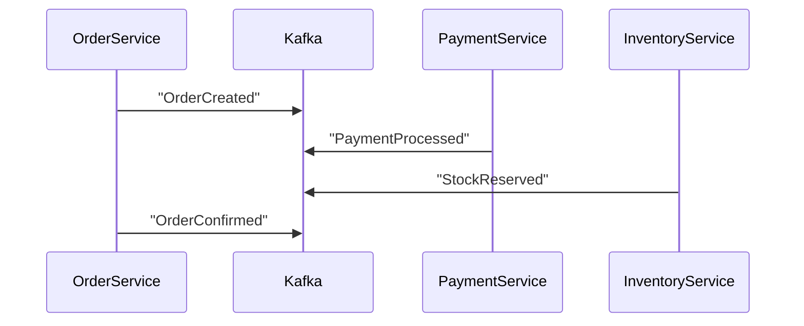

### **Decomposition Design Patterns in Microservices**  
Decomposition is the process of breaking down a monolithic application into smaller, loosely coupled microservices. Choosing the right decomposition strategy is critical to avoid creating a **distributed monolith**. Below are the key patterns and methodologies:

---

## **1. Decomposition by Business Capability**  
**What**: Split services based on **business domains** (e.g., Order, Payment, Inventory).  
**When**:  
- Clear business domains exist.  
- Teams align with business functions (e.g., Payments Team → `PaymentService`).  

**Example**:  
```
E-Commerce App:
├── UserService (Authentication/Profiles)
├── OrderService (Order Management)
├── PaymentService (Payment Processing)
├── InventoryService (Stock Tracking)
└── NotificationService (Emails/Alerts)
```  
**Pros**:  
✅ Aligns with organizational structure (Conway’s Law).  
✅ High cohesion within services.  

**Cons**:  
❌ Requires clear domain boundaries.  

---

## **2. Decomposition by Subdomain (DDD)**  
**What**: Use **Domain-Driven Design (DDD)** to identify **Bounded Contexts** (autonomous subdomains).  
**When**:  
- Complex domains with distinct subdomains (e.g., `Shipping` vs. `Billing`).  

**DDD Concepts**:  
- **Core Domain**: Critical business logic (e.g., `Order Processing`).  
- **Supporting Subdomain**: Non-core (e.g., `User Reviews`).  
- **Generic Subdomain**: Common functionality (e.g., `Email Notifications`).  

**Example**:  
```
┌───────────────────────┐
│       Order Domain    │
│  - OrderService       │
│  - PaymentService     │
└───────────┬───────────┘
            │
┌───────────▼───────────┐
│     Shipping Domain   │
│  - ShippingService    │
│  - TrackingService    │
└───────────────────────┘
```  
**Pros**:  
✅ Matches business reality.  
✅ Reduces ambiguity in service boundaries.  

**Cons**:  
❌ Requires deep domain analysis.  

---

## **3. Decomposition by Transactions (Saga Pattern)**  
**What**: Split services based on **transactional boundaries** and use **Sagas** for distributed transactions.  
**When**:  
- ACID transactions span multiple services (e.g., `Order → Payment → Inventory`).  

**Saga Approaches**:  
- **Choreography**: Services emit events (e.g., Kafka) to trigger next steps.  
- **Orchestration**: Central coordinator (e.g., AWS Step Functions) manages flow.  

**Example (Choreography)**:  

**Pros**:  
✅ Avoids distributed locks.  
✅ Scalable and decoupled.  

**Cons**:  
❌ Complex to debug.  

---

## **4. Decomposition by Strangler Fig Pattern**  
**What**: Incrementally replace a monolith by **"strangling"** old functionality with new microservices.  
**When**:  
- Migrating from a monolith to microservices.  

**Steps**:  
1. Identify a feature to extract (e.g., `UserAuth`).  
2. Route traffic to new `AuthService` while keeping the monolith as fallback.  
3. Gradually phase out the monolith’s auth code.  

**Pros**:  
✅ Low-risk migration.  
✅ No big-bang rewrite.  

**Cons**:  
❌ Temporary complexity during transition.  

---

## **5. Decomposition by Technical Capability**  
**What**: Split by **technical function** (e.g., `ImageProcessingService`, `CacheService`).  
**When**:  
- Reusable cross-cutting concerns (e.g., logging, caching).  

**Example**:  
```
┌───────────────────────┐
│   ImageService        │
│  - Resize/Compress    │
└───────────────────────┘
┌───────────────────────┐
│   CacheService        │
│  - Redis-backed       │
└───────────────────────┘
```  
**Pros**:  
✅ Promotes reusability.  

**Cons**:  
❌ Risk of creating "utility" services with low cohesion.  

---

## **6. Decomposition by Volatility (Rate of Change)**  
**What**: Separate services based on **how often they change** (e.g., stable vs. volatile components).  
**When**:  
- Parts of the system evolve at different speeds (e.g., `Billing` vs. `RecommendationEngine`).  

**Example**:  
- **Stable**: `UserService` (rarely changes).  
- **Volatile**: `AIService` (frequent updates).  

**Pros**:  
✅ Isolate instability.  

**Cons**:  
❌ Hard to predict future changes.  

---

### **Comparison Table**  
| Pattern                  | Best For                          | Pros                          | Cons                          |
|--------------------------|-----------------------------------|-------------------------------|-------------------------------|
| **Business Capability**  | Clear business domains            | Aligns with teams             | Requires domain expertise     |
| **DDD Subdomains**       | Complex domains                   | Matches reality               | Time-consuming analysis       |
| **Saga Pattern**         | Distributed transactions          | No distributed locks          | Debugging challenges          |
| **Strangler Fig**        | Monolith migration                | Low-risk                      | Temporary complexity          |
| **Technical Capability** | Cross-cutting concerns            | Reusable                      | Low cohesion risk             |
| **Volatility**           | Differing change rates            | Isolate instability           | Unpredictable evolution       |

---

### **Key Takeaways**  
1. **Start with Business Capabilities or DDD** for clean boundaries.  
2. **Use Sagas** for transactions spanning services.  
3. **Strangler Pattern** for safe monolith migrations.  
4. **Avoid decomposition by technical layers** (e.g., `ControllerService`, `DBService`)—this creates a distributed monolith.  

### **When to Use Which?**  
- **New Project?** → **Business Capability** or **DDD**.  
- **Breaking a Monolith?** → **Strangler Fig**.  
- **Need Transactions?** → **Saga Pattern**.  

Would you like a deep dive into a specific pattern (e.g., implementing Sagas with Kafka)?


-----------------------------------


In **microservices architecture**, **decomposition design patterns** help break down a large monolithic system into **smaller, independent services**. These patterns guide **how to split a system** based on different dimensions like business domains, functionalities, or subdomains.

---

## ✅ **Key Decomposition Patterns in Microservices**

---

### 🔹 1. **Decompose by Business Capability**

> Break the system into services based on high-level **business functions**.

* **Each service aligns with a business domain** (e.g., User, Order, Payment).
* Promotes strong **ownership and autonomy**.
* Based on **Domain-Driven Design (DDD)** principles.

#### 🔸 Example:

| Business Domain     | Microservice     |
| ------------------- | ---------------- |
| Customer Management | Customer Service |
| Product Catalog     | Product Service  |
| Order Processing    | Order Service    |

---

### 🔹 2. **Decompose by Subdomain (DDD Approach)**

> Use **Bounded Contexts** from Domain-Driven Design to split services.

* Each microservice is responsible for a **subdomain** in a larger context.
* Avoids ambiguity and **ensures cohesion** within services.

#### 🔸 Example:

In a banking app:

* `Account Management` subdomain → Account Service
* `Transaction Processing` subdomain → Transaction Service
* `Fraud Detection` subdomain → Fraud Service

---

### 🔹 3. **Decompose by Use Case or Workflow**

> Split services based on **specific user journeys or workflows**.

* Useful when services are **tightly coupled by a workflow** (e.g., Order → Payment → Shipping).
* Focuses on **real-world use cases** rather than static data models.

#### 🔸 Example:

E-commerce checkout:

* `Cart Service`, `Checkout Service`, `Payment Service`, `Shipping Service`

---

### 🔹 4. **Decompose by Resource or Entity**

> Break down by key **domain entities** (like User, Product, Invoice).

* Straightforward and easy to implement for **simple domains**.
* May cause **tight coupling** if multiple services rely heavily on the same entity.

#### 🔸 Example:

* Product entity → ProductService
* User entity → UserService
* Invoice entity → InvoiceService

---

### 🔹 5. **Decompose by Volatility (Change Frequency)**

> Group functionality that changes frequently together, and isolate stable parts.

* Helps minimize ripple effects of changes.
* Useful in fast-evolving domains like marketing, recommendation engines.

---

### 🔹 6. **Decompose by Team Ownership**

> Match service boundaries with **team structure (Conway's Law)**.

* Aligns with DevOps and **team autonomy**.
* Each team owns the full lifecycle of the service (build, deploy, maintain).

---

### 🔹 7. **Strangler Pattern (Monolith to Microservices Migration)**

> Incrementally **replace parts of a monolith** with microservices.

* Route specific requests to new services via **API Gateway**.
* Gradual, low-risk migration strategy.

---

## 🧠 Summary Table

| Pattern             | Best Used When                             |
| ------------------- | ------------------------------------------ |
| Business Capability | Align with domain structure, DDD           |
| Subdomain (DDD)     | Well-defined bounded contexts              |
| Use Case / Workflow | Complex workflows with defined steps       |
| Resource / Entity   | Simple CRUD apps or entity-centric systems |
| Volatility          | Isolate fast-changing modules              |
| Team Ownership      | For scaling DevOps culture                 |
| Strangler Pattern   | Migrating from monolith to microservices   |

---

## 🔧 Tips for Applying Decomposition

* Avoid **anemic services** (too fine-grained, dependent on each other).
* Don’t split too early — **start with a modular monolith**, and decompose when necessary.
* Favor **loosely coupled and highly cohesive services**.
* **Use API contracts or events** to communicate between services.

---

Would you like a **visual architecture diagram** showing how these decomposition patterns look in a microservices system?
