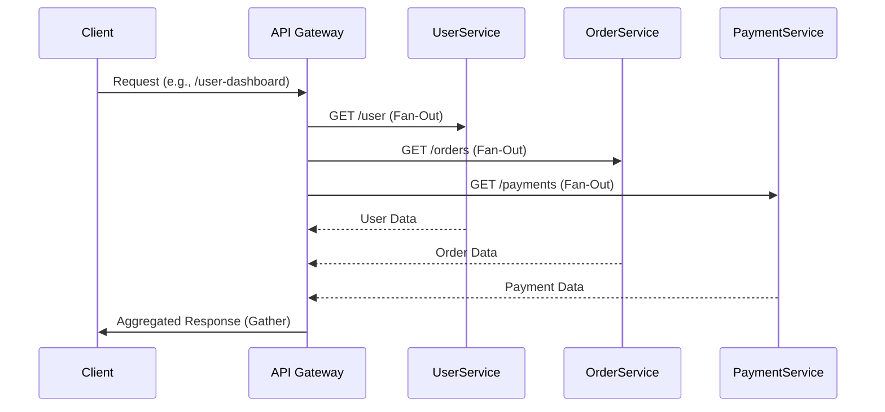

# **Fan-Out Pattern in Microservices**

The **Fan-Out** pattern (also called *scatter-gather*) is a messaging strategy where:
1. A **single request** is sent to **multiple services** in parallel (*fan-out*).
2. Results are **aggregated** into a single response (*gather*).

## **When to Use It**
✅ **Parallel Processing**: When independent tasks can run concurrently.  
✅ **Data Aggregation**: Combining results from multiple microservices (e.g., dashboard data).  
✅ **High Performance**: Reduces latency by avoiding sequential calls.  

---

## **How It Works**


---

## **Implementation Options**
### **1. Spring WebClient (Reactive)**
```java
public Mono<Dashboard> getUserDashboard(String userId) {
    Mono<User> user = webClient.get().uri("/users/{id}", userId).retrieve().bodyToMono(User.class);
    Mono<List<Order>> orders = webClient.get().uri("/orders?userId={id}", userId).retrieve().bodyToFlux(Order.class).collectList();
    Mono<List<Payment>> payments = webClient.get().uri("/payments?userId={id}", userId).retrieve().bodyToFlux(Payment.class).collectList();

    return Mono.zip(user, orders, payments)
              .map(tuple -> new Dashboard(tuple.getT1(), tuple.getT2(), tuple.getT3()));
}
```

### **2. Apache Kafka (Event-Driven)**
1. **Publish** a `UserDashboardRequest` event to Kafka.
2. **Subscribe**:
   - `UserService` emits `UserDataResponse`.
   - `OrderService` emits `OrderDataResponse`.
3. **Aggregate** responses in a stateful service (e.g., `DashboardService`).

### **3. AWS Step Functions (Orchestration)**
```json
{
  "Comment": "Fan-Out Dashboard Data",
  "StartAt": "Parallel",
  "States": {
    "Parallel": {
      "Type": "Parallel",
      "End": true,
      "Branches": [
        {"StartAt": "GetUser", "States": { ... }},
        {"StartAt": "GetOrders", "States": { ... }},
        {"StartAt": "GetPayments", "States": { ... }}
      ]
    }
  }
}
```

---

## **Pros & Cons**
| **Pros**                          | **Cons**                                  |
|-----------------------------------|------------------------------------------|
| ⚡ **Faster than sequential calls** | 🧩 **Complex error handling** (partial failures) |
| 🛠 **Decouples services**          | 📊 **Overhead for small payloads**       |
| 🚀 **Scales horizontally**         | 🔄 **Requires idempotency**              |

---

## **Best Practices**
1. **Set Timeouts**: Avoid hanging on slow services.
   ```java
   webClient.get()
       .uri("/users/{id}", userId)
       .timeout(Duration.ofSeconds(2))  // Fail fast
   ```
2. **Handle Failures Gracefully**:
   - Use `onErrorResume()` in WebClient.
   - Implement circuit breakers (Resilience4j).
3. **Cache Responses**: For idempotent data (e.g., user profiles).

---

## **Alternatives**
- **API Composition**: Gateway fetches data sequentially (simpler but slower).
- **CQRS**: Pre-aggregate data in a read-optimized DB.

---

### **Example: E-Commerce Dashboard**
**Problem**: A dashboard needs data from 3 services:  
- User profile (`UserService`)  
- Order history (`OrderService`)  
- Payment status (`PaymentService`)  

**Fan-Out Solution**:  
1. Fetch all 3 datasets **in parallel**.  
2. Merge into a single JSON response:  
```json
{
  "user": { "name": "Alice" },
  "orders": [ { "id": "123" } ],
  "payments": [ { "status": "completed" } ]
}
```

---

## **Key Takeaways**
1. Use **Fan-Out** when responses are independent and latency matters.  
2. **WebClient/Kafka/Step Functions** are common implementations.  
3. **Design for failure** (timeouts, fallbacks).  

For simple cases, prefer **API Composition**. For complex workflows, combine with **Saga Pattern**.  

Would you like a code walkthrough for error handling in Fan-Out?


----

### ✅ **Fan-Out Pattern in Microservices**

---

### 🔹 What Is the Fan-Out Pattern?

The **Fan-Out pattern** is a **message-based communication pattern** in microservices where **one service sends a request or event to multiple downstream services** **in parallel**.

It's commonly used in **event-driven architectures** to distribute work, trigger parallel processing, or notify multiple systems at once.

---

### 📦 Example Scenario:

Imagine an **Order Service** placing an order:

```
Order Service → Event Bus (e.g., Kafka)
       ├──→ Inventory Service
       ├──→ Notification Service
       └──→ Payment Service
```

All three downstream services **receive the same event/message** and perform their tasks independently.

---

### ✅ Use Cases for Fan-Out

| Use Case                    | Explanation                                                       |
| --------------------------- | ----------------------------------------------------------------- |
| **Parallel processing**     | Several services need to respond to the same event simultaneously |
| **Decoupled communication** | Services don't need to know about each other                      |
| **Audit or Logging**        | Events can be fanned out to a logging/audit service               |
| **Data replication**        | Fan out data changes to sync services                             |
| **Notifications**           | Fan out events to email/SMS/webhook services                      |

---

### 🔧 Implementation Approaches

---

#### 🔹 1. **Event Broker (Recommended)**

Use a **message broker** like Kafka, RabbitMQ, or Redis Streams.

##### 🔸 Example: Spring Boot + Kafka

**Publisher:**

```java
kafkaTemplate.send("order.created", orderEvent);
```

**Consumers:**

* Inventory Service → listens to `order.created`
* Notification Service → listens to `order.created`
* Payment Service → listens to `order.created`

All are **independent** and process **in parallel**.

---

#### 🔹 2. **REST Fan-Out (Synchronous — Not Recommended for Scale)**

The origin service makes **multiple HTTP calls** to other services.

```java
restTemplate.postForObject("http://inventory-service/update", payload);
restTemplate.postForObject("http://notification-service/email", payload);
```

❌ **Drawbacks:**

* Tightly coupled
* Slower due to synchronous calls
* Fails if one downstream service fails

---

### ✅ Advantages of Fan-Out Pattern

| Benefit          | Why It Helps                                  |
| ---------------- | --------------------------------------------- |
| High scalability | Services can scale independently              |
| Loose coupling   | Services don’t need to know each other        |
| Fault isolation  | Failure in one consumer doesn't affect others |
| Async processing | Improves responsiveness                       |

---

### ⚠️ Challenges

| Challenge           | Solution                                                            |
| ------------------- | ------------------------------------------------------------------- |
| Message duplication | Use **message IDs**, deduplication logic                            |
| Ordering            | Use partitioned topics (Kafka) or sequence numbers                  |
| Failure handling    | Dead letter queues, retries, circuit breakers                       |
| Debugging           | Use **Trace ID/Span ID**, distributed tracing tools (Zipkin/Jaeger) |

---

## 📌 Summary

| Topic       | Details                                         |
| ----------- | ----------------------------------------------- |
| Pattern     | Fan-Out (one-to-many communication)             |
| When to Use | Multiple services need to act on the same event |
| How to Use  | Use message brokers like Kafka/RabbitMQ         |
| Benefit     | Scalable, loosely coupled, async                |
| Risk        | Needs robust error handling and tracing         |

---

## 🧠 Bonus: Combine with Saga Pattern

Fan-Out is often used as part of a **Choreographed Saga**, where each service listens to events and triggers next steps independently.

---

Would you like a **Spring Boot Kafka-based Fan-Out example project** or a **diagram showing the flow** of a Fan-Out pattern?
