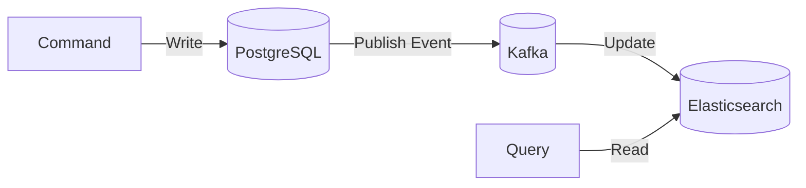

## Say in a microservices that more readers or happening at the any given point of time and then right operations what kind of design pattern we are going to implement ?

In a microservices architecture where **read operations significantly outnumber write operations**, the **CQRS (Command Query Responsibility Segregation) pattern** is the most suitable design pattern to implement. Here’s why and how to apply it:

---

### **Why CQRS?**
1. **Optimized Read Performance**:  
   - Separate read and write databases allow you to **scale reads independently** (e.g., using caching, read replicas, or optimized query models).  
   - Example: Writes go to a transactional SQL DB (PostgreSQL), while reads use a denormalized NoSQL DB (MongoDB) or cache (Redis).  

2. **Reduced Contention**:  
   - Heavy reads won’t block writes (and vice versa).  

3. **Flexible Data Models**:  
   - Tailor read models for specific queries (e.g., materialized views for dashboards).  

---

### **How to Implement CQRS**
#### **1. Separate Command and Query Paths**
- **Commands (Writes)**:  
  - Modify state (e.g., `POST /orders`).  
  - Write to a **primary database** (e.g., PostgreSQL).  
- **Queries (Reads)**:  
  - Fetch data (e.g., `GET /orders`).  
  - Read from a **optimized read store** (e.g., Elasticsearch, Redis, or a read replica).  

#### **2. Use Event Sourcing (Optional but Powerful)**
- **Writes** emit events (e.g., `OrderPlaced`) to Kafka/RabbitMQ.  
- **Read models** subscribe to events and update denormalized views.  



#### **3. Scale Reads Horizontally**
- Deploy multiple read service replicas.  
- Use **caching** (Redis) for frequent queries.  

#### **4. Eventual Consistency**
- Acknowledge that read models may lag behind writes (acceptable for most use cases).  
- Use **webhooks or polling** to notify clients of updates.  

---

### **Example: E-Commerce System**
#### **Problem**:  
- 100x more reads (product listings, user dashboards) than writes (order placements).  

#### **Solution**:  
1. **Write Path**:  
   - `OrderService` writes to PostgreSQL and emits `OrderCreated` to Kafka.  
2. **Read Path**:  
   - `OrderReadService` listens to Kafka, updates Redis/Elasticsearch.  
   - API serves reads from Redis (low latency).  

```java
// Command (Write)
@PostMapping("/orders")
public void createOrder(@RequestBody OrderCommand command) {
  orderCommandService.create(command); // Writes to PostgreSQL
}

// Query (Read)
@GetMapping("/orders/{id}")
public OrderView getOrder(@PathVariable String id) {
  return orderQueryService.get(id); // Reads from Redis
}
```

---

### **Complementary Patterns**
1. **Cache-Aside**:  
   - Cache popular queries (e.g., `GET /products/top-selling`).  
2. **Read Replicas**:  
   - Replicate SQL data to scale reads (e.g., PostgreSQL read replicas).  
3. **Materialized Views**:  
   - Pre-compute complex queries (e.g., monthly sales reports).  

---

### **When NOT to Use CQRS**
- **Simple CRUD apps** with balanced read/write ratios.  
- **Strong consistency requirements** (e.g., banking transactions).  

---

### **Tools & Technologies**
| Purpose               | Tools                                                                 |
|-----------------------|-----------------------------------------------------------------------|
| **Event Streaming**   | Kafka, RabbitMQ                                                      |
| **Read Databases**    | Elasticsearch, MongoDB, Redis, PostgreSQL read replicas              |
| **Caching**           | Redis, Memcached                                                     |
| **Frameworks**        | Axon Framework (Java), MediatR (.NET), Spring Cloud                  |

---

### **Key Takeaways**
1. Use **CQRS** when reads vastly outnumber writes.  
2. Decouple writes (commands) from reads (queries) for **independent scaling**.  
3. Combine with **caching** and **event sourcing** for high performance.  
4. Accept **eventual consistency** in read models.  

Would you like a detailed example with Kafka and Spring Boot?

--------------------------

If your microservices system experiences **many more read operations than write operations**, the most appropriate **design pattern** to implement is:

---

## ✅ **CQRS (Command Query Responsibility Segregation) Pattern**

---

### 🔹 Why CQRS?

When:

* **Reads are far more frequent** than writes
* **Performance, scalability**, or **response time** for reads is critical
* Different **data shapes** are needed for reading vs writing

CQRS helps you:

* **Scale read and write paths independently**
* Optimize the read model for **fast queries**
* Reduce load on your write database
* Handle **complex querying** without compromising transactional integrity

---

### 🔸 CQRS in Action

#### ✅ **Command Side (Write)**

* Handles create, update, delete
* Writes go into a **Write DB** (normalized, transactional)
* Emits events when data changes

#### ✅ **Query Side (Read)**

* Handles all read requests
* Reads from a **Read DB** (can be denormalized, cached, indexed)
* Read DB is updated using **events from write service**

---

### 🔸 Example Flow

```
[Client]
   |
   +--> [Command API] --> [Write DB]
   |         |
   |         +-- emits Event --> [Query Updater]
   |                                 |
   +----------------------------- [Read DB] <-- [Query API]
```

---

### 🔸 Technologies Often Used with CQRS

| Component       | Tool/Tech Example             |
| --------------- | ----------------------------- |
| Command side    | Spring Boot, JPA, MySQL       |
| Event transport | Kafka, RabbitMQ               |
| Read side       | Redis, Elasticsearch, MongoDB |
| Event handling  | Spring Cloud Stream, Axon     |

---

### ✅ Advantages

* **Performance**: Fast reads via optimized Read DB
* **Scalability**: Scale read and write independently
* **Flexibility**: Different storage or formats for reading
* **Resilience**: Read DB can tolerate high traffic without affecting writes

---

### ⚠️ Trade-offs

* **Increased complexity**: Two data models, event handling
* **Eventual consistency**: Read DB might lag slightly behind writes
* **More moving parts**: Requires coordination between services

---

### 🧠 Summary

| When to Use CQRS?                     | Why?                                          |
| ------------------------------------- | --------------------------------------------- |
| High read-to-write ratio              | To improve query performance                  |
| Read and write concerns diverge       | To separate logic and data models             |
| Scalability is important              | To scale read replicas without write pressure |
| Need for denormalized or indexed data | Optimize reads via custom structures          |

---

Would you like a **Spring Boot-based CQRS architecture with Kafka and MongoDB**, or a **visual diagram showing the flow**?
