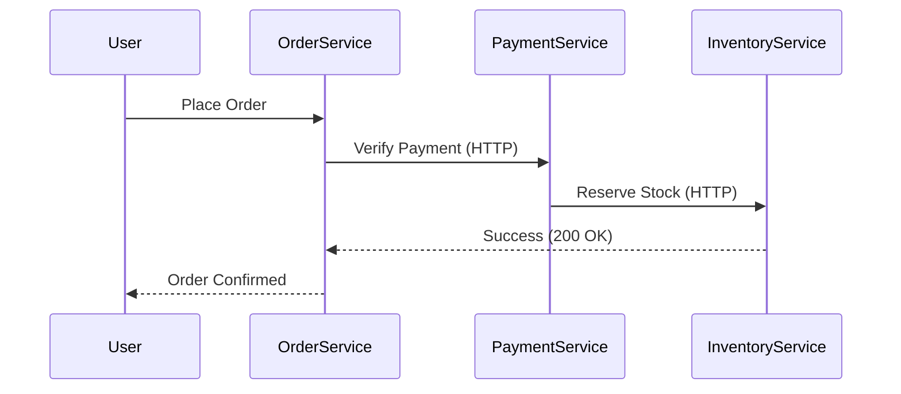
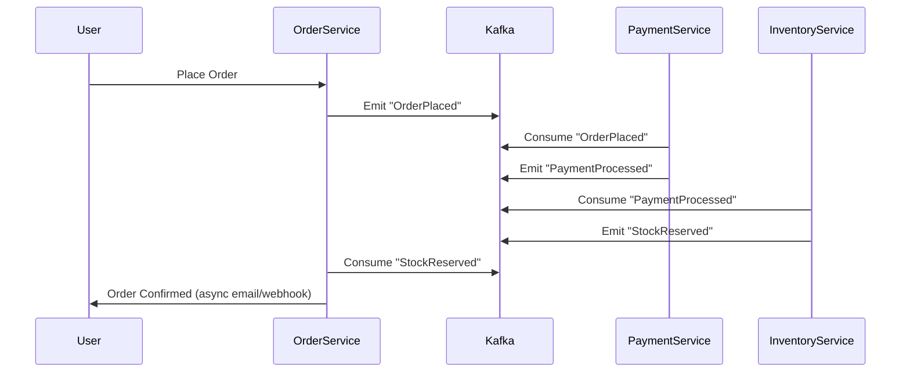

Using **synchronous communication** (e.g., HTTP/REST, gRPC) for critical microservices with **variable or high latency** can lead to systemic failures. Here’s what happens and how to mitigate it:

---

### **Problems with Synchronous Communication in High-Latency Scenarios**
1. **Cascading Failures**  
   - If **Service A** calls **Service B** synchronously, and **B** is slow/fails, **A** blocks and may also fail, propagating downtime upstream.

2. **Poor Performance**  
   - Latency adds up linearly (e.g., if 3 services each take 500ms, total latency = **1.5s**).

3. **Resource Exhaustion**  
   - Threads/connections pile up waiting for responses, leading to **timeouts** or crashes (e.g., thread pool exhaustion in Java apps).

4. **Tight Coupling**  
   - Services become dependent on each other’s availability, violating microservices’ **resilience** principle.

---

### **Alternatives to Synchronous Communication**
#### **1. Asynchronous Messaging (Event-Driven Architecture)**
- **Tools**: Kafka, RabbitMQ, AWS SQS/SNS, NATS.  
- **Patterns**:  
  - **Event Sourcing**: Services emit events (e.g., `OrderPlaced`) rather than waiting for replies.  
  - **Pub/Sub**: Decouple producers and consumers.  
- **Example**:  
  ```python
  # Payment Service emits an event (Kafka)
  producer.send("payment-processed", {"order_id": 123, "status": "success"})
  
  # Order Service consumes it asynchronously
  consumer.subscribe("payment-processed", process_payment_event)
  ```
- **Pros**:  
  - No blocking calls.  
  - Retries and dead-letter queues handle failures gracefully.  

#### **2. Circuit Breakers**
- **Tools**: Resilience4j (Java), Polly (.NET), Hystrix (legacy).  
- **How it Works**:  
  - Fail fast if a downstream service is slow/unavailable.  
  - Fallback mechanisms (e.g., cached response).  
- **Example (Spring Boot)**:  
  ```java
  @CircuitBreaker(name = "inventoryService", fallbackMethod = "fallback")
  public Inventory checkStock(String itemId) {
    return restTemplate.getForObject("/inventory/" + itemId, Inventory.class);
  }
  
  public Inventory fallback(String itemId, Throwable t) {
    return Inventory.empty(); // Fallback response
  }
  ```

#### **3. Saga Pattern (For Distributed Transactions)**
- **Use Case**: Replace synchronous ACID transactions with eventual consistency.  
- **Tools**: Temporal, AWS Step Functions, custom state machines.  
- **Example**:  
  - **Order Saga**:  
    1. `OrderService` starts a saga.  
    2. Emits `ReserveInventory` (async).  
    3. On failure, emits `CompensateOrder` to rollback.  

#### **4. API Gateways with Timeout/Retry Policies**
- **Tools**: Kong, Istio, Envoy.  
- **Config**:  
  ```yaml
  # Istio VirtualService (timeout/retry)
  http:
  - route:
    - destination:
        host: payment-service
    timeout: 2s
    retries:
      attempts: 3
      perTryTimeout: 1s
  ```

#### **5. CQRS (Command Query Responsibility Segregation)**
- **Use Case**: Separate reads (fast, cacheable) from writes (async, eventual consistency).  
- **Tools**: Apache Kafka, Elasticsearch (for read models).  

#### **6. Backpressure Mechanisms**
- **Tools**: RSocket, Project Reactor.  
- **How it Works**: Lets services signal when they’re overwhelmed.  

---

### **When to *Still* Use Synchronous Communication**
- **Low-Latency Requirements**: Internal services in the same data center.  
- **Simple CRUD**: Non-critical paths (e.g., fetching static data).  
- **Immediate Feedback Needed**: User authentication (but with circuit breakers).  

---

### **Example: E-Commerce Checkout**
#### **Bad (Synchronous)**

- **Risk**: If `InventoryService` times out, the whole flow fails.  

#### **Good (Async/Event-Driven)**

- **Advantage**: Each service processes events at its own pace. Failures are isolated.  

---

### **Key Takeaways**
1. **Avoid Synchronous Calls for Critical Paths** if latency is unpredictable.  
2. **Use Async + Events** (Kafka, RabbitMQ) for decoupling.  
3. **Add Resilience** with circuit breakers, retries, and sagas.  
4. **Monitor Latency** (Prometheus, distributed tracing) to identify bottlenecks.  

Would you like a deep dive into implementing one of these patterns (e.g., Kafka event-sourcing)?


-----------------------------

If you use **synchronous communication** for **critical microservices with varying latencies**, several **problems** can arise that can degrade the reliability, scalability, and user experience of your application.

---

## 🔴 **Problems with Synchronous Communication in High-Latency Critical Services**

### 1. ⏳ **Request Blocking**

* The caller waits for a response.
* If the callee is slow or down, the **entire chain is delayed or blocked**.
* Increases **end-to-end latency**.

> ❌ A slow service becomes a bottleneck for the whole system.

---

### 2. 🔗 **Tight Coupling**

* Services are **dependent on each other’s availability**.
* A failure in one microservice can **cascade** and take down others.

---

### 3. 🧨 **Reduced Fault Tolerance**

* Any network blip or timeout between services causes **failures**.
* Retrying too aggressively leads to **retry storms**, **exhaustion**, or **out-of-memory**.

---

### 4. 📈 **Poor Scalability**

* More requests = more open connections = higher resource usage.
* Cannot handle burst loads or spikes effectively.

---

### 5. 💣 **Failure Propagation**

* If downstream service crashes, upstream requests fail too.
* This creates **system-wide outages** instead of isolated failures.

---

## ✅ **Alternatives to Synchronous Communication**

Here are **safer and more scalable approaches**:

---

### 🔁 1. **Asynchronous Messaging (Recommended)**

Use a **message broker** like **Kafka**, **RabbitMQ**, or **ActiveMQ**.

#### 🔸 Benefits:

* Non-blocking communication
* Improved fault tolerance
* Natural support for **event-driven** and **retry mechanisms**
* Services don’t need to be up at the same time

#### 🔸 Example:

* Order Service publishes `order.created` event
* Payment and Notification Services consume it asynchronously

---

### 🔁 2. **Event-Driven Architecture**

Services communicate by **publishing and subscribing to events**.

#### 🔸 Tools:

* Apache Kafka
* Redis Streams
* NATS

#### 🔸 Benefits:

* Decoupled microservices
* Highly scalable
* Easy to add new consumers without modifying publishers

---

### 💬 3. **Command Queue Pattern**

Put requests as commands in a **queue**, let consumers **process at their own pace**.

#### Example:

* Payment Service sends "Verify Card" to queue
* Verification Worker processes and sends back the result

---

### 🔐 4. **Callback or Webhook-Based Design**

* Call the service and provide a **callback URL**
* Service calls you back when it’s done

> Useful when processing takes time but you still want a response

---

### 💾 5. **Polling (Last Resort)**

* Periodically check the status of a long-running task
* Not efficient but can be useful when async isn’t feasible

---

## 🛡️ Extra Tips for Resilient Communication

If synchronous is unavoidable:

* Use **circuit breakers** (e.g., Resilience4j, Hystrix)
* Use **timeouts** and **retry with backoff**
* Use **bulkheads** to isolate failures
* Cache read-heavy responses if possible

---

## 🚦 Decision Guide

| Scenario                                        | Preferred Communication           |
| ----------------------------------------------- | --------------------------------- |
| Fast, low-latency, simple call                  | ✅ Synchronous                     |
| Long-running or variable latency                | ✅ Asynchronous                    |
| Critical workflows with high availability needs | ✅ Event-driven or messaging       |
| Third-party or external service                 | ✅ Async + retry + circuit breaker |

---

### ✅ Summary:

> **Using synchronous calls for critical, latency-sensitive microservices can cause cascading failures, tight coupling, and poor scalability.**
> Use **asynchronous messaging, event-driven design**, or **command queues** to improve resilience, fault isolation, and scalability.

---

Would you like an example of converting a synchronous Spring Boot microservice call to an async Kafka-based design?
