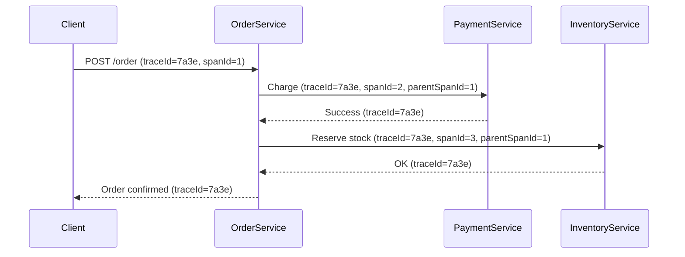

### **Trace ID and Span ID in Distributed Tracing**  
**Trace ID** and **Span ID** are core concepts in **distributed tracing**, used to track requests as they propagate across microservices. Tools like **Jaeger**, **Zipkin**, and **AWS X-Ray** rely on these identifiers to visualize request flows and diagnose latency issues.

---

## **1. Key Concepts**  
### **Trace ID**  
- **What**: A **unique identifier** for an entire request journey (e.g., a user clicking "Checkout" in an e-commerce app).  
- **Scope**: Shared across all microservices involved in processing the request.  
- **Example**: `traceId=7a3e5b1c2d4f6a8b`  

### **Span ID**  
- **What**: A **unique identifier** for a single operation within a trace (e.g., a call to `PaymentService`).  
- **Scope**: Unique to a specific service or function.  
- **Example**: `spanId=d8e7f6a5c4b3`  

### **Parent-Span ID**  
- Links child spans to their parent, showing the hierarchy of calls.  
- **Example**: A call from `OrderService` → `PaymentService` generates:  
  - `OrderService` span: `spanId=abc`, `parentSpanId=null`  
  - `PaymentService` span: `spanId=def`, `parentSpanId=abc`  

---

## **2. How They Work Together**  


---

## **3. How to Implement Tracing**  
### **Step 1: Add Distributed Tracing Libraries**  
**Spring Boot (with Sleuth + Zipkin/Jaeger):**  
```xml
<!-- Spring Cloud Sleuth (auto-generates Trace/Span IDs) -->
<dependency>
    <groupId>org.springframework.cloud</groupId>
    <artifactId>spring-cloud-starter-sleuth</artifactId>
</dependency>

<!-- Export traces to Jaeger -->
<dependency>
    <groupId>io.opentelemetry</groupId>
    <artifactId>opentelemetry-exporter-jaeger</artifactId>
</dependency>
```

### **Step 2: Propagate Headers**  
Sleuth auto-injects headers into HTTP requests:  
- **`X-B3-TraceId`**: Trace ID.  
- **`X-B3-SpanId`**: Span ID.  
- **`X-B3-ParentSpanId`**: Parent Span ID.  

**Manually propagate headers (if needed):**  
```java
// Feign Client example
@FeignClient(name = "payment-service")
public interface PaymentClient {
    @GetMapping("/charge")
    String charge(@RequestHeader("X-B3-TraceId") String traceId);
}
```

### **Step 3: View Traces in Jaeger/Zipkin**  
1. Run Jaeger locally:  
   ```bash
   docker run -d -p 16686:16686 jaegertracing/all-in-one
   ```
2. Visit `http://localhost:16686` and search by `traceId`.  

---

## **4. Log Correlation**  
Include `traceId` and `spanId` in logs for debugging:  
**Logback Example (`logback-spring.xml`):**  
```xml
<pattern>%d{HH:mm:ss} [%thread] [%X{traceId:-},%X{spanId:-}] %-5level %logger{36} - %msg%n</pattern>
```
**Output**:  
```
14:30:45 [http-nio-8080-exec-1] [7a3e5b1c2d4f6a8b,d8e7f6a5c4b3] INFO  com.example.OrderService - Order created.
```

---

## **5. Advanced: Custom Spans**  
Create nested spans for complex operations:  
```java
import brave.Span;
import brave.Tracer;

@Autowired
private Tracer tracer;

void processOrder() {
    Span span = tracer.nextSpan().name("processOrder").start();
    try (Tracer.SpanInScope ws = tracer.withSpanInScope(span)) {
        // Business logic
    } finally {
        span.finish();
    }
}
```

---

## **6. Best Practices**  
1. **Always propagate headers** (HTTP, Kafka, gRPC).  
2. **Keep traces sampled** (1-10% in production to reduce overhead).  
3. **Use structured logging** with `traceId` for debugging.  
4. **Monitor trace latency** to identify bottlenecks.  

---

## **7. Tools Comparison**  
| **Tool**    | **Pros**                                  | **Cons**                          |
|-------------|-------------------------------------------|-----------------------------------|
| **Jaeger**  | Open-source, Kubernetes-native.           | Requires infrastructure setup.    |
| **Zipkin**  | Simple, lightweight.                      | Fewer features than Jaeger.       |
| **AWS X-Ray**| Integrates with AWS services.            | Vendor lock-in.                   |
| **Sleuth**  | Auto-configures Trace/Span IDs (Spring).  | Limited to Spring ecosystem.      |

---

## **Example: Troubleshooting with Trace ID**  
**Problem**: A checkout request fails intermittently.  
**Solution**:  
1. Find the `traceId` in logs (`7a3e5b1c2d4f6a8b`).  
2. Search in Jaeger:  
   - Identifies the `PaymentService` span failing with a 500 error.  
3. Fix: Retry logic for payment timeouts.  

---

## **Key Takeaways**  
1. **Trace ID** = Entire request flow.  
2. **Span ID** = Individual operation.  
3. **Propagate headers** across HTTP/Kafka/gRPC.  
4. **Use Jaeger/Zipkin** to visualize traces.  
5. **Correlate logs** with `traceId` for debugging.  

Would you like a step-by-step guide for integrating Jaeger with Kubernetes?


----------------------


### ✅ **Trace ID and Span ID in Microservices**

In a distributed microservices architecture, tracing requests end-to-end across multiple services is essential for **debugging, performance monitoring**, and **root cause analysis**.

To achieve this, we use **Trace IDs** and **Span IDs** as part of **distributed tracing**.

---

## 🔍 What Are Trace ID and Span ID?

| Term               | Description                                                                      |
| ------------------ | -------------------------------------------------------------------------------- |
| **Trace ID**       | A **unique ID for the entire request flow** through multiple services.           |
| **Span ID**        | A **unique ID for a single unit of work** (e.g., a call to a method or service). |
| **Parent Span ID** | Connects child spans to the parent operation to form a tree.                     |

---

### 🔸 Example Scenario:

```
[Client] ──> [API Gateway] ──> [Order Service] ──> [Payment Service]
                  |               |                   |
              Trace ID         Trace ID           Trace ID (same)
              Span ID: A       Span ID: B         Span ID: C
               Parent: -        Parent: A          Parent: B
```

> All services share the **same Trace ID** for one request chain
> Each service generates a **new Span ID** for its own operation

---

## 🔧 Tools That Use Trace/Span IDs

| Tool                    | Purpose                                      |
| ----------------------- | -------------------------------------------- |
| **Spring Cloud Sleuth** | Auto-generates Trace/Span IDs in Spring Boot |
| **Zipkin**              | Collects and visualizes traces               |
| **Jaeger**              | Alternative to Zipkin (more scalable)        |
| **OpenTelemetry**       | Vendor-neutral tracing standard              |

---

## ✅ How to Use in Spring Boot

### 1️⃣ Add Dependencies

```xml
<dependency>
  <groupId>org.springframework.cloud</groupId>
  <artifactId>spring-cloud-starter-sleuth</artifactId>
</dependency>

<dependency>
  <groupId>org.springframework.cloud</groupId>
  <artifactId>spring-cloud-starter-zipkin</artifactId>
</dependency>
```

### 2️⃣ Configuration (`application.yml`)

```yaml
spring:
  zipkin:
    base-url: http://localhost:9411  # Zipkin server
  sleuth:
    sampler:
      probability: 1.0  # Trace all requests (in dev)
```

### 3️⃣ Send Trace Context Across Services

Spring Cloud Sleuth **automatically propagates** trace headers like:

* `X-B3-TraceId`
* `X-B3-SpanId`
* `X-B3-ParentSpanId`
* `X-B3-Sampled`

If you use **RestTemplate, WebClient**, or **Feign**, it will auto-add these headers.

---

### 4️⃣ Example: Propagating Trace Info

```java
@RestController
public class OrderController {

    @Autowired
    private RestTemplate restTemplate;

    @GetMapping("/order")
    public String createOrder() {
        // Sleuth will auto-propagate trace ID
        return restTemplate.getForObject("http://payment-service/pay", String.class);
    }
}
```

In logs, you'll see something like:

```
2025-06-19 10:45:32.123 [TRACE_ID:abc123 SPAN_ID:def456] OrderController - Order created
```

---

## 🧭 Trace Navigation Across Microservices

1. A request enters the system through Gateway or Frontend
2. Trace ID is generated
3. Each service call creates a **child span**
4. Trace and Span IDs are passed automatically
5. Tools like **Zipkin or Jaeger** show the full **trace tree**

---

### 📊 Sample Zipkin UI Trace

```
Trace ID: abc123
 ├── API Gateway     (Span: A)
 ├── Order Service   (Span: B, Parent: A)
 │     └── Inventory Service (Span: C, Parent: B)
 └── Payment Service (Span: D, Parent: A)
```

---

## 🛡️ Benefits of Using Trace/Span IDs

| Benefit               | How It Helps                     |
| --------------------- | -------------------------------- |
| End-to-end visibility | See request flow across services |
| Bottleneck detection  | Identify slow spans or services  |
| Root cause analysis   | Pinpoint where failure started   |
| Centralized logging   | Correlate logs using trace ID    |

---

## 🧠 Summary

| Concept       | Description                            |
| ------------- | -------------------------------------- |
| Trace ID      | Unique per request across all services |
| Span ID       | Unique per operation in a service      |
| Sleuth        | Auto-generates and propagates IDs      |
| Zipkin/Jaeger | Visualizes the full trace tree         |

---

Would you like a **working Spring Boot microservices example** with Sleuth and Zipkin integration to trace requests across 2–3 services?
