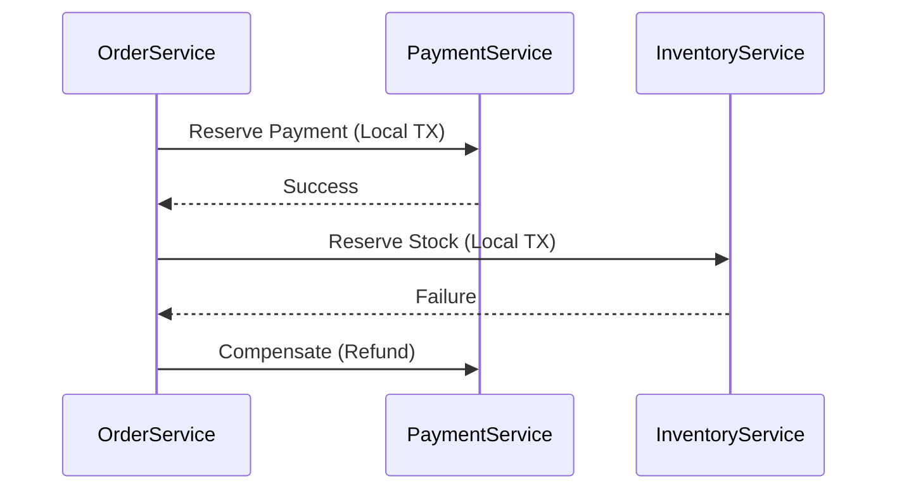

# **`@Transactional` in Spring: Purpose, Isolation Levels, and Microservices Handling**

## **1. Purpose of `@Transactional`**
The `@Transactional` annotation in Spring ensures that a **series of database operations** either **all succeed (commit)** or **all fail (rollback)**. It simplifies transaction management without manual `begin`, `commit`, or `rollback` calls.

### **Key Features**
- **Atomicity**: All operations in a transaction succeed or fail together.
- **Consistency**: Ensures data integrity constraints are met.
- **Isolation**: Controls visibility of changes to concurrent transactions.
- **Durability**: Committed changes persist even after system failures.

### **Basic Usage**
```java
@Service
public class OrderService {

    @Autowired
    private OrderRepository orderRepository;

    @Transactional  // Rolls back if an exception occurs
    public void placeOrder(Order order) {
        orderRepository.save(order);
        inventoryService.updateStock(order.getItems()); // Another DB operation
    }
}
```

---

## **2. Transaction Isolation Levels**
Isolation levels define **how transactions interact with each other** when accessing the same data.

| **Isolation Level**          | **Description**                                                                 | **Use Case**                          |
|------------------------------|---------------------------------------------------------------------------------|---------------------------------------|
| **`READ_UNCOMMITTED`**       | Allows dirty reads (reading uncommitted changes).                               | Rarely used (risk of inconsistencies).|
| **`READ_COMMITTED` (Default)**| Prevents dirty reads but allows non-repeatable reads.                           | Most common (balance of safety & perf).|
| **`REPEATABLE_READ`**        | Ensures repeatable reads but allows phantom reads.                              | High consistency needs (e.g., reports).|
| **`SERIALIZABLE`**           | Highest isolation (locks rows/tables).                                          | Critical transactions (e.g., banking).|

### **How to Set Isolation Level**
```java
@Transactional(isolation = Isolation.REPEATABLE_READ)
public void updateOrder(Order order) {
    // Business logic
}
```

---

## **3. Transaction Propagation**
Defines **how transactions behave when nested**.

| **Propagation**            | **Description**                                                                 |
|----------------------------|---------------------------------------------------------------------------------|
| **`REQUIRED` (Default)**   | Joins an existing transaction or creates a new one.                             |
| **`REQUIRES_NEW`**         | Always starts a new transaction (suspends the current one if it exists).        |
| **`SUPPORTS`**             | Runs in a transaction if one exists; otherwise, executes non-transactionally.   |
| **`NOT_SUPPORTED`**        | Suspends the current transaction if one exists.                                 |
| **`NEVER`**                | Throws an exception if a transaction exists.                                    |
| **`MANDATORY`**            | Requires an existing transaction; throws an exception otherwise.                |

### **Example**
```java
@Transactional(propagation = Propagation.REQUIRES_NEW)
public void auditLog(AuditEntry entry) {
    // Runs in a separate transaction
}
```

---

## **4. Handling Transactions in Microservices**
### **Challenge**  
In microservices, transactions often span **multiple services/databases**, making traditional ACID transactions impossible.

### **Solutions**
#### **1. Saga Pattern**  
- **What**: Breaks a transaction into **local transactions** with **compensating actions**.
- **Tools**:  
  - **Choreography**: Events (Kafka) trigger compensating actions.  
  - **Orchestration**: Central coordinator (AWS Step Functions, Temporal).  

**Example (Order Saga)**:


#### **2. Two-Phase Commit (2PC) (Avoid in Microservices)**  
- **Problem**: Blocking, poor scalability.  
- **Alternative**: Use **eventual consistency** (Sagas).

#### **3. Outbox Pattern**  
- **What**: Store events in a DB table (`outbox`) and relay them via Kafka.  
- **Ensures**: Atomicity between DB updates and event publishing.  

**Example**:
```java
@Transactional
public void placeOrder(Order order) {
    orderRepository.save(order);
    outboxRepository.save(new OutboxEvent("OrderCreated", order.getId()));
}
```

---

## **5. Best Practices for Microservices Transactions**
1. **Avoid Distributed Transactions** (Use Sagas or eventual consistency).  
2. **Use `REQUIRES_NEW` for Critical Operations** (e.g., audit logs).  
3. **Set Timeouts** to prevent long-running locks:  
   ```java
   @Transactional(timeout = 5)  // 5 seconds
   ```
4. **Monitor Deadlocks** (e.g., with `@Retryable` for transient failures).  
5. **Combine with Idempotency** (Handle duplicate requests safely).  

---

## **6. Common Pitfalls**
| **Pitfall**                | **Solution**                                  |
|----------------------------|----------------------------------------------|
| **Long-running transactions** | Break into smaller chunks, use Sagas.      |
| **Dirty reads**            | Use `READ_COMMITTED` or higher.              |
| **Deadlocks**              | Optimize queries, add retries.               |
| **Ignoring rollbackFor**   | Specify exceptions that trigger rollback:    |
|                            | `@Transactional(rollbackFor = PaymentFailedException.class)` |

---

## **Summary**
- **`@Transactional`** ensures atomicity in Spring applications.  
- **Isolation Levels** control visibility of concurrent changes.  
- **Propagation** defines transaction boundaries.  
- **Microservices** require **Sagas** or **eventual consistency** (avoid 2PC).  
- **Outbox Pattern** safely integrates DB updates with event publishing.  

For complex workflows, consider **Temporal.io** or **AWS Step Functions** for orchestration.  

Would you like a deep dive into implementing Sagas with Kafka?

------

Great question! In microservices, **transactions** are more complex than in monoliths. Let's break down `@Transactional`, different transaction **isolation levels**, and how to handle transactions **across microservices**.

---

## ✅ `@Transactional` in Spring

### 🔹 Purpose

The `@Transactional` annotation manages **transaction boundaries** in a Spring application.

### 🔸 Common Use Cases:

* Ensure **ACID properties** (Atomicity, Consistency, Isolation, Durability)
* Automatically commit or rollback based on success/failure
* Handle nested method calls with transaction propagation

---

## 🔹 How It Works

```java
@Transactional
public void processOrder() {
    // All DB operations inside this method are part of the same transaction
}
```

* On **exception**, the transaction **rolls back**
* On **success**, it **commits**

---

## 🔹 Transaction Propagation Levels

These define how a method's transaction should behave when called from another transactional method.

| Propagation          | Behavior                                                       |
| -------------------- | -------------------------------------------------------------- |
| `REQUIRED` (default) | Join the current transaction or start a new one if none exists |
| `REQUIRES_NEW`       | Always start a new transaction, suspending the existing one    |
| `NESTED`             | Run within a nested transaction (supports savepoints)          |
| `MANDATORY`          | Must run within an existing transaction                        |
| `NEVER`              | Must not run within a transaction                              |
| `SUPPORTS`           | Join if a transaction exists, else run non-transactionally     |
| `NOT_SUPPORTED`      | Run outside of any transaction (suspends if one exists)        |

```java
@Transactional(propagation = Propagation.REQUIRES_NEW)
```

---

## 🔹 Transaction Isolation Levels

Isolation levels define **how transaction integrity is maintained** when multiple transactions access the same data concurrently.

| Level              | Prevents             | Notes                          |
| ------------------ | -------------------- | ------------------------------ |
| `READ_UNCOMMITTED` | Nothing              | Allows dirty reads             |
| `READ_COMMITTED`   | Dirty reads          | Default for many DBs           |
| `REPEATABLE_READ`  | Non-repeatable reads | Prevents phantom reads         |
| `SERIALIZABLE`     | Phantom reads        | Most strict, least concurrency |

```java
@Transactional(isolation = Isolation.REPEATABLE_READ)
```

---

## 🛠️ Handling Transactions in Microservices

Transactions **across microservices are tricky**, since each service has its **own DB** (by design).

### ❌ Don’t Use Distributed Transactions (XA)

* Complex
* Poor performance
* Not cloud-native

---

## ✅ Best Practices for Microservice Transactions

---

### 🔹 1. **Eventual Consistency (Recommended)**

Use **asynchronous communication** + **compensating transactions** for rollback.

* E.g., Order Service → Payment Service → Inventory Service
* If Inventory fails, publish a rollback event

---

### 🔹 2. **Saga Pattern**

A **choreographed or orchestrated** set of local transactions with **compensation logic**.

#### 🔸 Choreography (Decentralized)

Each service reacts to events and emits its own:

```
OrderCreated → PaymentProcessed → InventoryReduced
                         ↳ PaymentFailed → OrderCancelled
```

#### 🔸 Orchestration (Centralized)

A coordinator (Saga orchestrator) calls each service and decides next step or rollback:

```java
OrderSaga.start()
  .then(PaymentService::debit)
  .then(InventoryService::deduct)
  .compensateIfFail(PaymentService::refund, InventoryService::restock)
```

Tools: **Axon, Camunda, Orchestration Service**

---

### 🔹 3. **Outbox Pattern**

To ensure **reliable event publishing** from within a transaction.

* Write event to an `outbox` table in the same DB
* Use a **separate message relay service** to publish it to Kafka/RabbitMQ

---

## 🧠 Summary

| Concept            | Details                                        |
| ------------------ | ---------------------------------------------- |
| `@Transactional`   | Declares method as part of DB transaction      |
| Propagation        | Controls how nested transactions behave        |
| Isolation Levels   | Defines how concurrent access is handled       |
| Microservices TXNs | Use Saga Pattern, Eventual Consistency, Outbox |
| Don't Use          | XA/2PC in microservices (heavy & slow)         |

---

Would you like:

* A **code example of Saga pattern** with Spring Boot and Kafka?
* A **demo of @Transactional with nested methods** and rollback behaviors?

Let me know!
